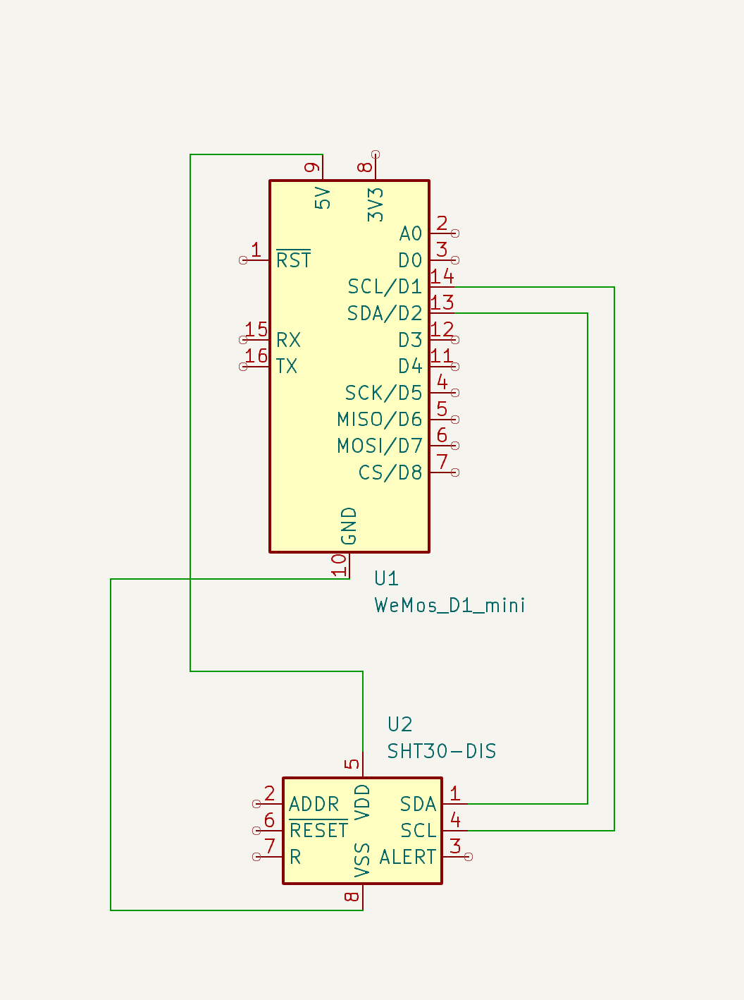
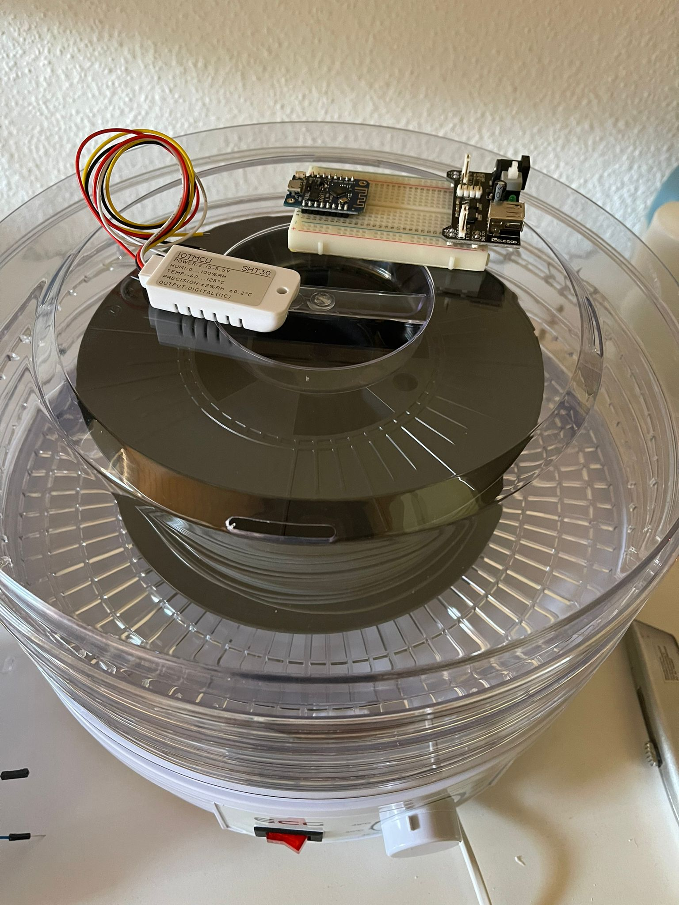

# Filament Drybox Sensor

Upon acquiring this Food Drybox, I sought to monitor its temperature and humidity levels.

To achieve this, I opted to utilize a D1 Mini (ESP8266) along with the SHT30 sensor (rated up to 125°C).

The data collected by the sensor will be stored in InfluxDB.

## Setup

For swift testing, useDocker Compose and follow the setup instructions for InfluxDB.

This project currently utilizes PlatformIO in conjunction with the Arduino Framework.
Create `influxdb.h` and `secrets.h` files from the provided examples, and populate them with your information. Once completed, you are prepared to upload the firmware via PlatformIO.

## KiCad

Please follow [this](https://jnavila.github.io/plotkicadsch/) Blog post to setup Git for KiCad

## Todo's

[ ] create own Component in KiCad for SHT30
[ ] use a second sensor to measure outside the temperature
[ ] hook up a display to show the current measurement
